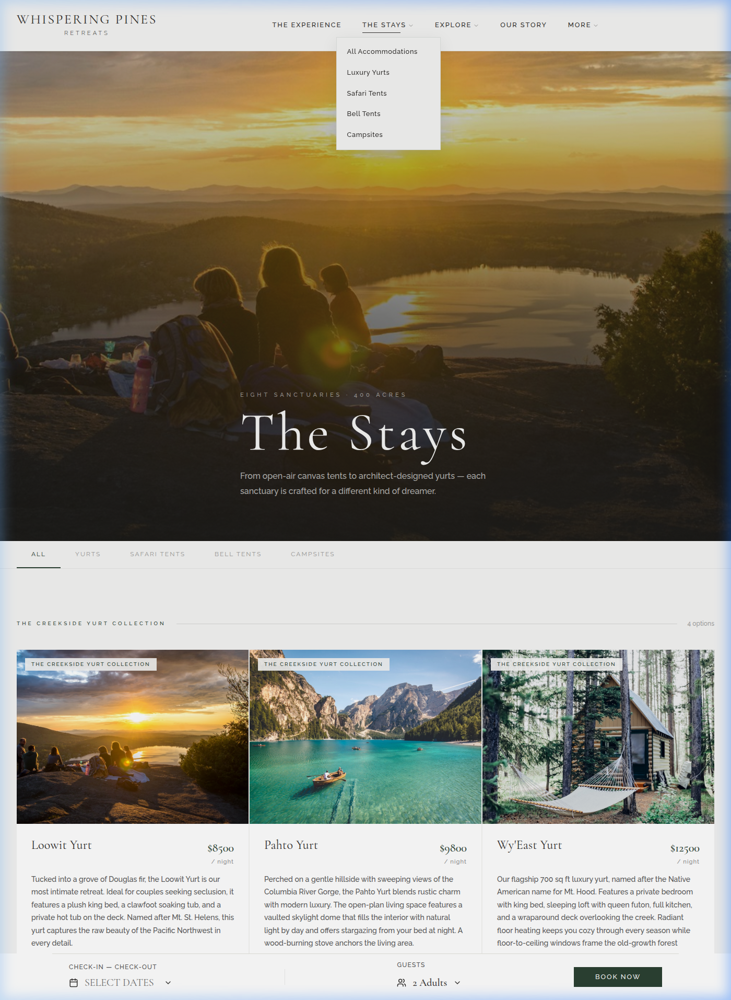
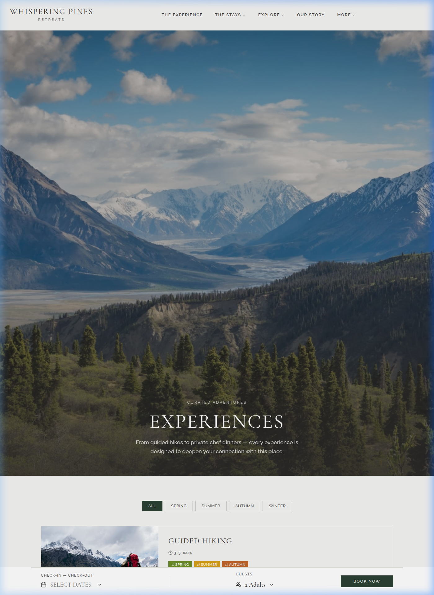
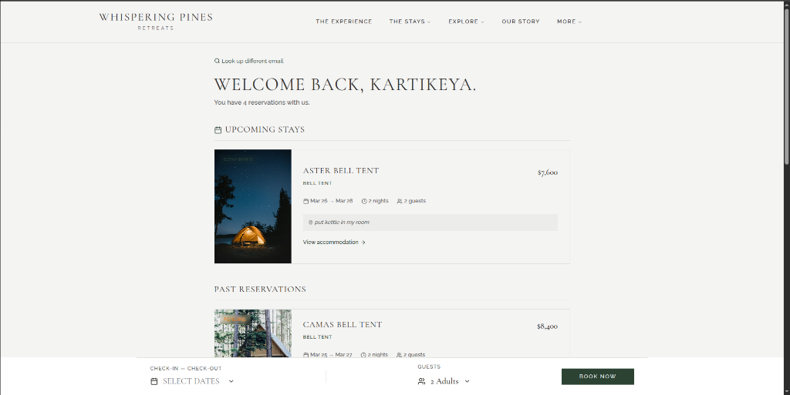
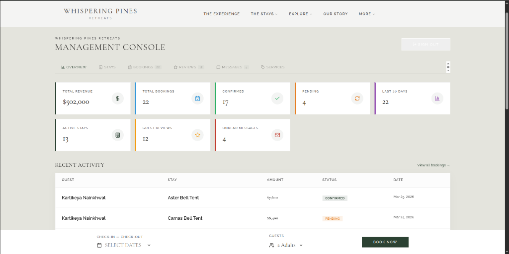

<p align="center">
  <h1 align="center">🌲 Whispering Pines Retreats</h1>
  <p align="center">
    <strong>Luxury Glamping in the Pacific Northwest</strong>
  </p>
  <p align="center">
    <a href="https://whispering-pines-amber.vercel.app">🌐 Live Demo</a> •
    <a href="https://whispering-pines-01-production.up.railway.app/health">🔧 API Status</a>
  </p>
</p>

<p align="center">
  
  
  
  
  
  
  
</p>

---

A **full-stack luxury glamping booking platform** featuring cinematic design, real-time availability checking, Stripe payment integration, an admin dashboard, and a guest portal. Built with a premium aesthetic that brings the Pacific Northwest wilderness to life.

## ✨ Screenshots

<p align="center">
  
  <br/><em>Cinematic hero with aerial video background and floating booking bar</em>
</p>

<p align="center">
  
  <br/><em>Accommodation listings with pricing, amenities, and category filters</em>
</p>

<p align="center">
  
  <br/><em>Curated outdoor experiences and adventure activities</em>
</p>

<p align="center">
  
  <br/><em>Personalized guest portal for managing upcoming and past reservations</em>
</p>

<p align="center">
  
  <br/><em>Seamless and secure payment processing powered by Stripe</em>
</p>

<p align="center">
  
  <br/><em>Comprehensive management console for revenue, bookings, and operations</em>
</p>

## 🏕️ Features

### Guest-Facing
- 🎬 **Cinematic Hero** — Full-screen aerial video with parallax scrolling
- 🏠 **13 Unique Accommodations** — Luxury yurts, safari tents, bell tents & campsites
- 📅 **Real-Time Booking Engine** — 4-step flow: Dates → Room → Enhancements → Checkout
- 💳 **Stripe Checkout** — Secure payment with Visa, Mastercard, Amex, Apple Pay & Google Pay
- ⭐ **Guest Reviews** — Social proof with star ratings
- 🗺️ **Interactive Trail Map** — Explore hiking trails on the property
- 🍽️ **Dining & Experiences** — Farm-to-table dining and curated adventures
- 📸 **Photo Gallery** — Lightbox gallery with high-res images
- 📰 **Blog** — Nature-focused articles and guides
- ❓ **FAQ Section** — Searchable frequently asked questions
- 📧 **Newsletter & Contact** — Email subscription and contact form

### Admin Dashboard
- 📊 **Analytics Overview** — Revenue, bookings, occupancy at a glance
- 🏨 **Accommodation Management** — CRUD operations for all listings
- 📋 **Booking Management** — View, confirm, and manage reservations
- ⭐ **Review Moderation** — Approve/reject guest reviews
- 📬 **Contact Inbox** — Read and manage guest inquiries
- 🔐 **JWT Authentication** — Secure admin login

## 🛠️ Tech Stack

### Frontend
| Technology | Purpose |
|---|---|
| **React 18** | UI framework with hooks |
| **TypeScript** | Type-safe development |
| **Vite** | Lightning-fast dev server & bundler |
| **Framer Motion** | Premium animations & page transitions |
| **Lucide React** | Beautiful icon library |
| **React Router** | Client-side routing |
| **React DatePicker** | Date range selection |

### Backend
| Technology | Purpose |
|---|---|
| **Express 4** | REST API framework |
| **TypeScript** | Type-safe server code |
| **Prisma ORM** | Database access & migrations |
| **PostgreSQL** | Production database (Aiven) |
| **Stripe SDK** | Payment processing |
| **JWT** | Authentication tokens |
| **Zod** | Request validation schemas |
| **Nodemailer** | Transactional emails |
| **Helmet** | Security headers |
| **Express Rate Limit** | API rate limiting |

## 📁 Project Structure

```
whispering-pines/
├── columbiagorge/              # 🖥️ Frontend (React + Vite)
│   ├── src/
│   │   ├── components/         # Reusable UI components
│   │   │   ├── Header.tsx      # Navigation with mega menu
│   │   │   ├── Hero.tsx        # Cinematic video hero
│   │   │   ├── BookingBar.tsx   # Floating date/guest picker
│   │   │   ├── Footer.tsx      # Site footer
│   │   │   └── ...
│   │   ├── pages/              # Route pages
│   │   │   ├── Home.tsx        # Landing page
│   │   │   ├── Accommodations.tsx
│   │   │   ├── Booking.tsx     # 4-step booking engine
│   │   │   ├── Admin.tsx       # Admin dashboard
│   │   │   └── ...
│   │   ├── data/               # Static content data
│   │   ├── context/            # Auth context provider
│   │   └── lib/                # API client
│   └── index.html
│
├── server/                     # ⚙️ Backend (Express + Prisma)
│   ├── src/
│   │   ├── controllers/        # Route handlers
│   │   ├── routes/             # API route definitions
│   │   ├── middleware/         # Auth, validation, rate limiting
│   │   ├── services/           # Business logic
│   │   ├── schemas/            # Zod validation schemas
│   │   ├── config/             # Environment config
│   │   └── db/                 # Prisma client
│   └── prisma/
│       ├── schema.prisma       # Database schema
│       └── seed.js             # Database seeder
│
├── railway.json                # Railway deployment config
└── package.json                # Root build orchestration
```

## 🚀 Quick Start

### Prerequisites
- **Node.js** ≥ 18
- **npm** ≥ 9
- **PostgreSQL** database (or use SQLite for local dev)

### 1. Clone & Install

```bash
git clone https://github.com/nainkhwalkartikeya13-cloud/whispering-pines-01.git
cd whispering-pines-01

# Install frontend dependencies
cd columbiagorge && npm install && cd ..

# Install backend dependencies
cd server && npm install && cd ..
```

### 2. Configure Environment

**Frontend** (`columbiagorge/.env`):
```env
VITE_API_URL=http://localhost:3001/api
VITE_STRIPE_PUBLISHABLE_KEY=pk_test_your_key_here
```

**Backend** (`server/.env`):
```env
NODE_ENV=development
PORT=3001
FRONTEND_URL=http://localhost:5173
DATABASE_URL="file:./dev.db"

JWT_SECRET=your_secret_key_min_16_chars
JWT_EXPIRES_IN=24h

STRIPE_SECRET_KEY=sk_test_your_key_here
STRIPE_WEBHOOK_SECRET=whsec_your_secret_here

SMTP_HOST=smtp-relay.brevo.com
SMTP_PORT=587
SMTP_USER=your_smtp_user
SMTP_PASS=your_smtp_pass

ADMIN_EMAIL=admin@example.com
ADMIN_PASSWORD=Admin123!
```

### 3. Set Up Database

```bash
cd server

# Push schema to database
npx prisma db push

# Seed with sample data
npm run db:seed
```

### 4. Run Development Servers

```bash
# Terminal 1 — Backend
cd server && npm run dev

# Terminal 2 — Frontend
cd columbiagorge && npm run dev
```

Visit **http://localhost:5173** 🎉

## 🌍 Deployment

### Frontend → Vercel
1. Import the repo on [Vercel](https://vercel.com)
2. Set **Root Directory** to `columbiagorge`
3. Add environment variables: `VITE_API_URL`, `VITE_STRIPE_PUBLISHABLE_KEY`

### Backend → Railway
1. Create a new project on [Railway](https://railway.app)
2. Connect your GitHub repo
3. Add a **PostgreSQL** database (or use external like Aiven)
4. Set environment variables in the **Variables** tab
5. The `railway.json` config handles build & start commands automatically

## 📡 API Endpoints

| Method | Endpoint | Description |
|---|---|---|
| `GET` | `/api/accommodations` | List all accommodations |
| `GET` | `/api/accommodations/:slug` | Get single accommodation |
| `POST` | `/api/bookings/check-availability` | Check date availability |
| `POST` | `/api/payments/create-checkout-session` | Create Stripe checkout |
| `POST` | `/api/payments/webhook` | Stripe webhook handler |
| `GET` | `/api/services` | List services & add-ons |
| `GET` | `/api/reviews` | List published reviews |
| `POST` | `/api/reviews` | Submit a review |
| `POST` | `/api/contact` | Submit contact form |
| `POST` | `/api/newsletter/subscribe` | Subscribe to newsletter |
| `POST` | `/api/auth/login` | Admin login |
| `GET` | `/api/analytics/overview` | Admin analytics |
| `GET` | `/health` | Health check |

## 🔒 Security

- 🔐 **JWT Authentication** for admin routes
- 🛡️ **Helmet.js** security headers (CSP, HSTS, X-Frame-Options)
- 🚦 **Rate Limiting** on all endpoints (200 req/15min global, 10 req/15min for payments)
- ✅ **Zod Validation** on all request bodies
- 🧹 **sanitize-html** for user-generated content
- 🔑 **bcrypt** password hashing (12 salt rounds)
- 🔏 **Stripe Webhook Signature** verification

## 📄 License

This project is for educational and portfolio purposes.

---

<p align="center">
  Made with 🌲 by <a href="https://github.com/nainkhwalkartikeya13-cloud">Kartikeya Nainkhwal</a>
</p>
